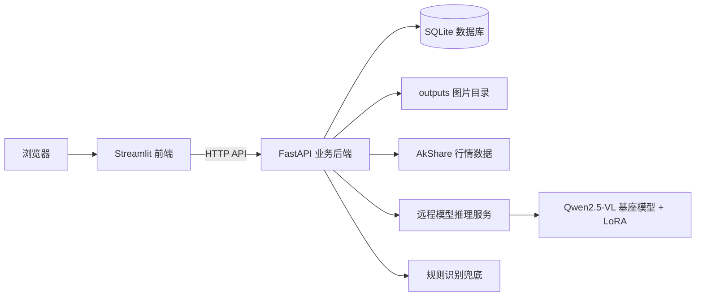

# K 线图形态识别系统项目说明

这份文档是给零基础同学阅读的项目学习手册。它会从“这个项目是干什么的”开始，逐步讲清楚目录结构、前端和后端怎么配合、数据库怎么保存数据、模型推理怎么接入、回测怎么实现，以及你以后想改功能应该去看哪些文件。

一句话理解这个项目：

> 用户在 Streamlit 页面上传一张 K 线图，或者输入股票代码和日期让系统自动生成 K 线图；FastAPI 后端负责保存图片、调用模型识别形态、把结果写入 SQLite 数据库，再把结果返回给前端展示，并支持对识别记录做简单回测和删除管理。

完整链路可以概括为：

```text
用户输入 -> Streamlit 前端 -> FastAPI 业务后端 -> 远程模型服务/规则兜底 -> SQLite + outputs 图片目录 -> 页面展示/回测/记录删除
```

---

## 1. 项目整体目标

这个项目做的是一个 K 线图形态识别系统，主要支持 4 类功能：

1. 上传本地 K 线图图片并识别形态。
2. 输入股票代码、日期区间和窗口大小，自动拉取行情数据并生成 K 线图，再识别形态。
3. 保存每次识别记录，支持历史记录查询、详情查看和删除管理。
4. 根据识别记录后续几个交易日的涨跌表现，做一个轻量级回测验证。

系统目前支持的识别标签包括：

| 标签 | 含义 | 信号方向 |
| --- | --- | --- |
| 头肩顶 | 顶部反转形态 | 偏空 |
| 头肩底 | 底部反转形态 | 偏多 |
| 双顶 | 两个相近高点形成顶部 | 偏空 |
| 双底 | 两个相近低点形成底部 | 偏多 |
| 上升三角形 | 高点趋平、低点抬高 | 偏多 |
| 下降三角形 | 低点趋平、高点下移 | 偏空 |
| 无明显形态 | 未识别出明确目标形态 | 中性 |

---

## 2. 技术栈怎么理解

这个项目虽然有“前端”和“后端”，但前后端都主要用 Python 写。

| 技术 | 在项目里的角色 | 新手可以这样理解 |
| --- | --- | --- |
| Streamlit | 前端页面 | 做网页界面，负责按钮、表单、图片和结果展示 |
| FastAPI | 业务后端 | 提供 HTTP API，接收前端请求，组织业务逻辑 |
| SQLite | 本地数据库 | 一个 `.sqlite3` 文件，保存识别记录 |
| requests | 前端调用后端 | Streamlit 用它向 FastAPI 发 HTTP 请求 |
| akshare | 行情数据来源 | 拉取 A 股历史行情 |
| pandas | 表格数据处理 | 处理 OHLCV 行情表格 |
| mplfinance | K 线图绘制 | 把行情表格画成蜡烛图图片 |
| Pillow | 图片处理 | 把生成的图片缩放到模型需要的尺寸 |
| OpenAI SDK / requests | 远程推理调用 | 支持 OpenAI 兼容接口，也支持自定义 FastAPI 推理接口 |
| Transformers + PEFT | 模型服务 | 在独立部署服务里加载 Qwen2.5-VL 和 LoRA |
| numpy + scipy | 规则识别 | 远程模型失败且有 OHLC 数据时，用规则算法兜底 |

---

## 3. 整体架构



需要特别分清两个“后端”：

| 后端 | 文件入口 | 作用 |
| --- | --- | --- |
| 业务后端 | `backend/main.py` | 给 Streamlit 调用，负责业务流程、数据库、图片、回测 |
| 模型推理后端 | `deployment/autodl_fastapi/app.py` | 独立部署在 AutoDL 等 GPU 机器上，真正加载 Qwen2.5-VL + LoRA |

也就是说，主项目本地启动后，通常是：

```text
浏览器 -> Streamlit -> 本地 FastAPI 业务后端 -> 远程 AutoDL 模型服务
```

---

## 4. 目录结构说明

项目根目录下的重要内容如下：

```text
klineSystem/
├─ streamlit_app.py                 # Streamlit 启动入口，只调用 frontend.app.main()
├─ requirements.txt                 # 本地运行所需依赖
├─ README.md                        # 当前这份说明文档
│
├─ frontend/                        # Streamlit 前端
│  ├─ app.py                        # 前端总入口，负责选择当前页面并渲染
│  ├─ shared.py                     # 前端公共函数：API 调用、状态、样式、通用组件
│  └─ pages/                        # 各个页面的具体实现
│     ├─ home.py                    # 首页，展示统计、状态、最近记录
│     ├─ upload.py                  # 上传图片识别页
│     ├─ generate.py                # 自动生成 K 线图并识别页
│     ├─ records.py                 # 历史识别记录页，支持查询、详情和删除
│     └─ backtest.py                # 回测分析页
│
├─ backend/                         # FastAPI 业务后端
│  ├─ main.py                       # 后端入口，创建 app、挂路由、挂静态资源、初始化数据库
│  ├─ config.py                     # 配置、目录发现、环境变量读取
│  ├─ schemas.py                    # Pydantic 请求/响应结构
│  ├─ routes/                       # API 路由层
│  │  ├─ context.py                 # 表单日期、窗口大小等上下文解析接口
│  │  ├─ prediction.py              # 上传识别、生成识别接口
│  │  ├─ records.py                 # 历史记录查询和删除接口
│  │  └─ backtest.py                # 回测接口
│  ├─ services/                     # 业务逻辑层
│  │  ├─ context_service.py         # 根据交易日补全/校验前端输入
│  │  ├─ kline_service.py           # 拉行情、选窗口、生成 K 线图
│  │  ├─ record_service.py          # 创建记录、查询记录、删除记录、生成图片 URL
│  │  └─ backtest_service.py        # 根据识别记录做未来走势验证
│  ├─ db/                           # 数据库层
│  │  ├─ database.py                # SQLite 连接和建表
│  │  └─ repository.py              # 具体 SQL 增查删操作
│  └─ utils/                        # 后端工具函数
│     ├─ date_utils.py              # 日期解析、标准化、时间戳
│     └─ labels.py                  # 标签映射、置信度处理、信号方向
│
├─ inference/
│  └─ model_service.py              # 业务后端调用远程模型，必要时用规则兜底
│
├─ kline_core/
│  ├─ data_loader.py                # 股票行情拉取、标准化、K 线图绘制、批量生成数据
│  └─ labeling.py                   # 基于规则的形态识别算法
│
├─ deployment/
│  └─ autodl_fastapi/               # 独立模型推理服务部署目录
│     ├─ app.py                     # 加载 Qwen2.5-VL + LoRA 并提供 /predict
│     ├─ start.sh                   # Linux/AutoDL 启动脚本
│     ├─ requirements.txt           # 模型服务依赖
│     └─ README.md                  # AutoDL 部署说明
│
├─ scripts/
│  ├─ start_local_services.ps1      # Windows 本地一键启动 Streamlit + FastAPI
│  ├─ dataset/                      # 数据集划分和 LLaMA-Factory JSON 构建脚本
│  └─ synthetic/                    # 合成 K 线训练图片脚本
│
├─ data/
│  └─ kline_records.sqlite3         # SQLite 数据库文件
│
├─ outputs/
│  ├─ uploads/                      # 用户上传图片保存处
│  ├─ generated/                    # 自动生成 K 线图保存处
│  └─ tmp/                          # 启动日志、临时输出
│
├─ models/                          # 本地基座模型文件目录
└─ adapters/                        # LoRA 适配器、checkpoint、训练结果
```

`__pycache__`、`*.cpython-*.pyc`、日志文件属于运行时产生的缓存或输出，不是理解业务逻辑的重点。

---

## 5. 前端如何工作

### 5.1 启动入口

前端启动文件是：

```text
streamlit_app.py
```

它只有一件事：

```python
from frontend.app import main

main()
```

真正的前端总控在：

```text
frontend/app.py
```

它的流程是：

1. 调用 `inject_css()` 注入页面样式。
2. 调用 `initialize_state()` 初始化 `st.session_state`。
3. 读取当前页面，比如首页、上传页、历史页。
4. 调后端 `/health` 获取系统状态。
5. 渲染左侧导航栏和顶部栏。
6. 根据当前页面调用对应的 `render_xxx_page()`。

### 5.2 页面怎么切换

页面信息定义在 `frontend/shared.py` 的 `PAGE_META` 中。

前端主要用两种方式记住当前页面：

| 状态来源 | 作用 |
| --- | --- |
| `st.session_state` | Streamlit 当前会话里的页面状态 |
| `st.query_params` | URL 上的 `?page=xxx` 参数 |

这样做的好处是，用户点击导航后页面能切换，刷新时也能尽量保留当前页面。

### 5.3 `frontend/shared.py` 为什么很重要

这个文件是前端公共工具箱，主要负责：

| 功能 | 相关函数 |
| --- | --- |
| 调后端接口 | `api_get()`、`api_post_json()`、`api_post_multipart()`、`api_delete()` |
| 读取后端健康状态 | `load_health_status()` |
| 读取历史记录 | `load_records_payload()` |
| 自动回测 | `fetch_backtest_result()` |
| 判断记录能否回测 | `record_can_backtest()` |
| 表单校验 | `validate_upload_date_inputs()`、`validate_generate_form_inputs()` |
| 页面状态 | `set_page()`、`get_current_page()`、`remember_record()` |
| 通用 UI | `render_stat_card()`、`render_fixed_image_preview()`、`render_backtest_visual()` 等 |

实际页面文件在 `frontend/pages/` 下。`shared.py` 底部保留了一些旧版页面渲染函数，但当前 `frontend/app.py` 使用的是 `frontend/pages/*.py` 中的页面实现。

---

## 6. 后端如何工作

后端入口是：

```text
backend/main.py
```

它创建 FastAPI 应用，并做几件关键事情：

1. 设置应用标题、版本和说明。
2. 开启 CORS，允许前端跨域调用。
3. 把 `outputs/` 挂成静态资源目录。
4. 注册各个路由。
5. 启动时创建必要目录并初始化 SQLite 表。
6. 提供 `/health` 健康检查接口。

静态资源挂载很关键：

```python
app.mount(config.static_mount_path, StaticFiles(directory=str(config.outputs_dir)), name="outputs")
```

它的意思是：`outputs/` 里的图片可以通过类似下面的 URL 访问：

```text
http://127.0.0.1:8000/outputs/generated/xxx.png
```

前端拿到这个 URL 后，就可以展示图片。

---

## 7. 后端分层设计

这个项目的后端结构比较清楚，可以按 4 层理解。

### 7.1 routes：接收 HTTP 请求

目录：

```text
backend/routes/
```

它负责：

1. 定义 API 路径。
2. 接收请求参数。
3. 做少量参数转换。
4. 调用 service。
5. 把结果返回给前端。

你可以把 `routes` 理解成“前台接待员”。

### 7.2 schemas：定义数据长什么样

文件：

```text
backend/schemas.py
```

它使用 Pydantic 定义请求体和响应体。例如：

| 类名 | 作用 |
| --- | --- |
| `GenerateAndPredictRequest` | 自动生成并识别接口的请求参数 |
| `PredictResponseSchema` | 上传识别接口返回结构 |
| `RecognitionRecordSchema` | 单条识别记录结构 |
| `DeleteRecordResponseSchema` | 删除识别记录接口返回结构 |
| `BacktestRequest` | 回测请求参数 |
| `BacktestResponseSchema` | 回测响应结构 |

你可以把 `schemas.py` 理解成“接口表格模板”。

### 7.3 services：真正做业务

目录：

```text
backend/services/
```

主要服务如下：

| 文件 | 职责 |
| --- | --- |
| `context_service.py` | 根据股票交易日校验和补全日期、窗口大小 |
| `kline_service.py` | 拉行情、截取窗口、生成 K 线图 |
| `record_service.py` | 写入识别记录、查询记录、删除记录、给图片生成 URL |
| `backtest_service.py` | 根据识别记录做后续交易日验证 |

你可以把 `services` 理解成“真正干活的人”。

### 7.4 db：和数据库打交道

目录：

```text
backend/db/
```

主要文件：

| 文件 | 职责 |
| --- | --- |
| `database.py` | 打开 SQLite 连接、创建表 |
| `repository.py` | 执行 SQL，比如插入记录、查询列表、查询单条记录、删除记录 |

你可以把 `db` 理解成“仓库管理员”。

---

## 8. API 接口总览

启动 FastAPI 后，可以打开在线接口文档：

```text
http://127.0.0.1:8000/docs
```

当前主要接口如下：

| 方法 | 路径 | 作用 | 主要由哪个页面调用 |
| --- | --- | --- | --- |
| `GET` | `/` | 后端根路径，确认服务运行 | 浏览器或调试 |
| `GET` | `/health` | 查看业务后端和远程模型服务状态 | 所有页面顶部状态栏 |
| `POST` | `/resolve_upload_context` | 上传页表单日期/窗口校验和补全 | 上传页 |
| `POST` | `/resolve_generate_context` | 自动生成页表单校验和补全 | 自动生成页 |
| `POST` | `/predict_image` | 上传图片并识别 | 上传页 |
| `POST` | `/generate_and_predict` | 拉行情、生成图、识别 | 自动生成页 |
| `GET` | `/records` | 查询历史记录列表 | 首页、历史页、回测页 |
| `GET` | `/record/{record_id}` | 查询单条历史记录详情 | 历史页 |
| `DELETE` | `/record/{record_id}` | 删除单条历史识别记录，并尝试清理关联图片 | 历史页 |
| `POST` | `/backtest` | 对某条识别记录做回测 | 上传页、自动生成页、回测页 |

---

## 9. 核心业务链路一：上传图片识别

对应前端页面：

```text
frontend/pages/upload.py
```

对应后端接口：

```text
POST /predict_image
```

完整流程如下：

1. 用户在上传页选择一张图片。
2. 用户可选填股票代码、开始日期、结束日期、窗口大小。
3. 前端先调用 `validate_upload_date_inputs()`，内部会请求 `/resolve_upload_context` 做日期和交易日校验。
4. 前端通过 `api_post_multipart()` 把图片和表单字段发给 `/predict_image`。
5. 后端把图片保存到 `outputs/uploads/`。
6. 后端调用 `inference_service.predict(image_path=...)` 识别图片。
7. 后端调用 `record_service.create_record()` 把结果写入 SQLite。
8. 后端调用 `attach_image_url()` 把本地图片路径转成前端可访问 URL。
9. 前端展示图片、标签、置信度、识别原因。
10. 如果这条记录有股票代码、窗口大小和日期，前端会自动调用 `/backtest` 做回测。

这里有一个重要限制：

上传图片只有图片本身，通常没有原始 OHLC 行情数据。所以如果远程模型服务不可用，上传图片链路一般不能使用规则识别兜底。

---

## 10. 核心业务链路二：自动生成 K 线图并识别

对应前端页面：

```text
frontend/pages/generate.py
```

对应后端接口：

```text
POST /generate_and_predict
```

完整流程如下：

1. 用户输入股票代码、开始日期、结束日期、窗口大小。
2. 前端调用 `validate_generate_form_inputs()`。
3. 这个校验函数会请求 `/resolve_generate_context`，由后端根据交易日补全缺失字段。
4. 前端把整理好的参数发给 `/generate_and_predict`。
5. 后端调用 `KlineChartService.generate_chart()`。
6. `generate_chart()` 先用 AkShare 拉行情，再按日期过滤。
7. 如果传了 `anchor_date`，会取锚点日期之前的窗口；否则默认取区间最后 `window_size` 个交易日。
8. 后端用 `mplfinance` 画 K 线图，再用 Pillow 缩放成 `448x448`。
9. 图片保存到 `outputs/generated/`。
10. 后端调用远程模型识别这张图。
11. 如果远程模型失败，并且有 `window_df` 行情数据，系统可用 `kline_core/labeling.py` 里的规则算法兜底。
12. 识别结果写入 SQLite。
13. 前端展示生成图、识别结果，并尝试自动回测。

自动生成链路比上传链路更稳，是因为它同时拥有：

| 数据 | 用途 |
| --- | --- |
| 图片 | 给视觉模型识别 |
| OHLC 行情表格 | 远程模型不可用时可以规则兜底，也可以回测 |

---

## 11. 核心业务链路三：历史记录查询与删除

对应前端页面：

```text
frontend/pages/records.py
```

对应后端接口：

```text
GET /records
GET /record/{record_id}
DELETE /record/{record_id}
```

查询流程如下：

1. 前端先调用 `/records` 获取记录列表。
2. 用户可以按股票代码、识别标签筛选。
3. 用户选择某条记录后，前端调用 `/record/{id}` 拉取详情。
4. 后端从 SQLite 读取记录。
5. `RecordService.attach_image_url()` 把 `image_path` 转成 `image_url`。
6. 前端展示图片、标签、置信度、来源、时间、回测入口等信息。

删除流程如下：

1. 用户在历史记录页选择一条记录并查看详情。
2. 前端显示“删除记录”区域，用户需要先勾选“确认删除记录 #id”。
3. 点击“删除该记录”后，前端通过 `api_delete()` 请求 `DELETE /record/{id}`。
4. 后端先确认记录存在，再调用 `repository.delete_record()` 删除 SQLite 中的记录。
5. 如果这条记录的图片位于项目 `outputs/` 目录下，`record_service.delete_record()` 会继续尝试删除对应图片文件。
6. 删除成功后，前端清空当前详情、回测缓存和相关页面状态，并刷新历史列表。

历史记录页负责展示、筛选、详情查看和删除入口，不直接做模型识别。

---

## 12. 核心业务链路四：回测分析

对应前端页面：

```text
frontend/pages/backtest.py
```

对应后端接口：

```text
POST /backtest
```

回测逻辑在：

```text
backend/services/backtest_service.py
```

它不是复杂的量化交易系统，而是一个轻量验证：

1. 根据 `record_id` 找到历史识别记录。
2. 确认记录里有 `stock_code`、`window_size`、`end_date`。
3. 从图片文件名或记录字段里解析识别窗口结束日期。
4. 拉取从开始日期到未来一段时间的行情。
5. 找到识别窗口结束日的位置。
6. 取后面 `horizon_days` 个交易日。
7. 比较窗口结束日收盘价和未来最后一天收盘价。
8. 根据标签判断结果是否成功：
   - 偏多标签未来上涨算成功。
   - 偏空标签未来下跌算成功。
   - 中性标签不判断成功或失败。

一条记录能否回测，取决于它是否具备这些字段：

| 字段 | 为什么需要 |
| --- | --- |
| `stock_code` | 回测需要重新拉行情 |
| `window_size` | 回测需要知道当时识别窗口多长 |
| `end_date` | 回测需要定位识别窗口结束位置 |

所以：

1. 自动生成页产生的记录通常可以回测。
2. 上传页如果没有补充股票代码、日期和窗口大小，就通常不能回测。

---

## 13. 数据库怎么设计

数据库文件在：

```text
data/kline_records.sqlite3
```

项目使用 SQLite，不需要单独安装 MySQL 或 PostgreSQL。SQLite 的特点是数据库就是一个本地文件，适合小型项目、课程项目和演示系统。

后端启动时会自动执行：

```python
init_db()
```

建表 SQL 在 `backend/db/database.py` 中：

```sql
CREATE TABLE IF NOT EXISTS recognition_records (
    id INTEGER PRIMARY KEY AUTOINCREMENT,
    stock_code TEXT,
    image_path TEXT NOT NULL,
    predicted_label TEXT NOT NULL,
    confidence REAL NOT NULL DEFAULT 0,
    reason TEXT,
    source_type TEXT NOT NULL,
    window_size INTEGER,
    start_date TEXT,
    end_date TEXT,
    backend_mode TEXT,
    created_at TEXT NOT NULL
);
```

字段说明：

| 字段 | 含义 |
| --- | --- |
| `id` | 识别记录编号，自增主键 |
| `stock_code` | 股票代码，比如 `600519` |
| `image_path` | 图片在本地磁盘上的绝对路径 |
| `predicted_label` | 模型预测出的形态标签 |
| `confidence` | 置信度，范围 0 到 1 |
| `reason` | 识别原因说明 |
| `source_type` | 来源类型，`upload` 或 `generated` |
| `window_size` | 识别窗口大小 |
| `start_date` | 识别区间开始日期 |
| `end_date` | 识别区间结束日期 |
| `backend_mode` | 本次识别使用的模型或后端名称 |
| `created_at` | 记录创建时间 |

注意：数据库里保存的是图片路径，不是图片二进制本身。

删除识别记录时，系统执行的是物理删除：数据库中的这一行会被移除，不会额外保留“已删除”状态字段。删除接口返回的 `image_deleted` 表示关联图片文件是否也被成功清理。

图片和数据库的配合关系是：

```text
图片保存到 outputs/ -> SQLite 保存 image_path -> 后端转换成 image_url -> 前端用 image_url 显示图片
```

---

## 14. 图片文件怎么管理

项目里的图片输出主要在：

```text
outputs/
├─ uploads/      # 上传页保存用户上传图片
├─ generated/    # 自动生成页保存生成的 K 线图
└─ tmp/          # 启动日志、临时文件
```

后端会把 `outputs/` 整个目录挂载为静态资源，所以图片可以通过 HTTP 地址访问。

例如本地文件：

```text
D:\Projects\klineSystem\outputs\generated\600519_xxx.png
```

可能会被转换为：

```text
http://127.0.0.1:8000/outputs/generated/600519_xxx.png
```

转换逻辑在：

```text
backend/services/record_service.py
```

核心函数是：

```python
attach_image_url()
```

删除记录时也会用到同一个服务文件里的 `delete_record()`。它只会尝试删除 `outputs/` 目录下由系统管理的图片，避免误删项目外部文件。

---

## 15. K 线图怎么生成

核心文件：

```text
backend/services/kline_service.py
kline_core/data_loader.py
```

生成流程如下：

1. `KlineChartService.fetch_dataframe()` 调用 `fetch_stock_data()`。
2. `fetch_stock_data()` 使用 AkShare 尝试多个数据源：
   - 东方财富日线
   - 腾讯日线
   - 新浪日线
3. 拉到数据后统一字段格式为：
   - `Date`
   - `Open`
   - `High`
   - `Low`
   - `Close`
   - `Volume`
4. 根据用户输入的日期过滤数据。
5. 通过 `select_window()` 选取识别窗口。
6. 通过 `save_and_resize_chart()` 画图并缩放到 `448x448`。
7. 图片保存到 `outputs/generated/`。

为什么要统一字段名？

不同数据源返回的列名可能不同，比如有的叫 `日期`，有的叫 `date`。模型和绘图逻辑不能每次适配各种名字，所以项目会先统一成标准 OHLCV 格式。

---

## 16. 模型推理怎么实现

推理调用入口在：

```text
inference/model_service.py
```

它本身通常不直接加载大模型，而是负责：

1. 判断远程模型服务是否配置好。
2. 调用远程接口。
3. 解析远程模型输出。
4. 把模型输出统一成 `PredictionResult`。
5. 必要时使用规则识别兜底。

它支持两种远程协议：

| 协议 | 配置值 | 说明 |
| --- | --- | --- |
| OpenAI 兼容接口 | `openai_compat` | 调 `/v1/chat/completions`，适合 vLLM 等服务 |
| 自定义 FastAPI | `custom_fastapi` | 调 `/predict`，适合本项目 `deployment/autodl_fastapi` 服务 |

当前 `scripts/start_local_services.ps1` 默认配置的是自定义 FastAPI：

```powershell
$env:KLINE_INFERENCE_BACKEND = "remote_api"
$env:KLINE_REMOTE_API_PROTOCOL = "custom_fastapi"
$env:KLINE_REMOTE_API_PREDICT_PATH = "/predict"
$env:KLINE_REMOTE_API_HEALTH_PATH = "/health"
```

真正加载 Qwen2.5-VL + LoRA 的服务在：

```text
deployment/autodl_fastapi/app.py
```

它会：

1. 读取 `KLINE_MODEL_BASE_DIR` 找到 Qwen2.5-VL 基座模型。
2. 读取 `KLINE_LORA_DIR` 找到 LoRA 适配器。
3. 用 Transformers 加载 `Qwen2_5_VLForConditionalGeneration`。
4. 用 PEFT 的 `PeftModel.from_pretrained()` 挂载 LoRA。
5. 提供：
   - `GET /health`
   - `POST /predict`

业务后端和模型后端的职责边界如下：

| 模块 | 是否加载大模型 | 主要职责 |
| --- | --- | --- |
| `backend/main.py` | 否 | 业务 API、数据库、图片、回测 |
| `inference/model_service.py` | 否 | 调远程模型、解析结果、规则兜底 |
| `deployment/autodl_fastapi/app.py` | 是 | 加载 Qwen2.5-VL + LoRA 并实际推理 |

---

## 17. 规则识别兜底怎么实现

规则识别在：

```text
kline_core/labeling.py
```

它不看图片，而是看 OHLC 表格数据。

基本思路是：

1. 从 `High` 和 `Low` 序列中提取局部高点和低点。
2. 对价格序列做轻微平滑，减少噪声。
3. 针对每种形态写一套判断规则。
4. 对候选形态计算分数。
5. 选分数最高的形态。
6. 都不满足时返回“无明显形态”。

主要规则函数：

| 函数 | 识别形态 |
| --- | --- |
| `check_double_bottom()` | 双底 |
| `check_double_top()` | 双顶 |
| `check_head_and_shoulders_top()` | 头肩顶 |
| `check_head_and_shoulders_bottom()` | 头肩底 |
| `check_ascending_triangle()` | 上升三角形 |
| `check_descending_triangle()` | 下降三角形 |
| `check_no_clear_pattern()` | 无明显形态 |

规则识别只在有 OHLC 数据时可用。因此自动生成识别可以兜底，单纯上传图片通常不能兜底。

---

## 18. 配置和环境变量

配置入口：

```text
backend/config.py
```

它负责：

1. 自动找到项目根目录。
2. 自动确定 `data/`、`outputs/`、`uploads/`、`generated/` 等路径。
3. 自动发现本地模型目录和 LoRA 目录。
4. 读取环境变量。
5. 创建必要目录。

常用环境变量如下：

| 环境变量 | 作用 | 默认值 |
| --- | --- | --- |
| `BACKEND_HOST` | FastAPI 主机 | `127.0.0.1` |
| `BACKEND_PORT` | FastAPI 端口 | `8000` |
| `STREAMLIT_BACKEND_URL` | Streamlit 调后端的地址 | `http://127.0.0.1:8000` |
| `KLINE_INFERENCE_BACKEND` | 推理后端模式 | `remote_api` |
| `KLINE_REMOTE_API_PROTOCOL` | 远程推理协议 | `openai_compat` |
| `KLINE_REMOTE_API_BASE_URL` | 远程推理服务地址 | `http://127.0.0.1:6006/v1` |
| `KLINE_REMOTE_API_PREDICT_PATH` | 自定义 FastAPI 推理路径 | `/predict` |
| `KLINE_REMOTE_API_HEALTH_PATH` | 自定义 FastAPI 健康检查路径 | `/health` |
| `KLINE_REMOTE_API_MODEL` | OpenAI 兼容接口模型名 | `kline-lora` |
| `KLINE_REMOTE_API_TIMEOUT` | 远程接口超时时间 | `300` |
| `KLINE_ALLOW_RULE_FALLBACK` | 是否允许规则兜底 | `true` |
| `KLINE_MODEL_BASE_DIR` | 本地或远程模型服务基座模型路径 | 自动发现或手动指定 |
| `KLINE_LORA_DIR` | LoRA 适配器路径 | 自动发现或手动指定 |

---

## 19. 本地如何运行

### 19.1 安装依赖

建议先创建虚拟环境：

```powershell
python -m venv .venv
.venv\Scripts\activate
pip install -r requirements.txt
```

### 19.2 一键启动

Windows 下可以运行：

```powershell
powershell -ExecutionPolicy Bypass -File .\scripts\start_local_services.ps1
```

这个脚本会：

1. 设置远程模型服务相关环境变量。
2. 启动 FastAPI 后端，默认端口 `8000`。
3. 启动 Streamlit 前端，默认端口 `8501`。
4. 把日志写入 `outputs/tmp/`。
5. 打印后端健康检查结果。

访问地址：

```text
Streamlit 前端：http://127.0.0.1:8501
FastAPI 文档：http://127.0.0.1:8000/docs
```

如果远程 AutoDL 服务地址变了，需要修改：

```text
scripts/start_local_services.ps1
```

里面的：

```powershell
$RemoteApiBaseUrl = "..."
```

### 19.3 手动启动

先启动后端：

```powershell
uvicorn backend.main:app --host 127.0.0.1 --port 8000 --reload
```

再启动前端：

```powershell
streamlit run streamlit_app.py
```

---

## 20. AutoDL 模型服务如何运行

模型服务目录：

```text
deployment/autodl_fastapi/
```

部署说明详见：

```text
deployment/autodl_fastapi/README.md
```

最核心的环境变量是：

```bash
export KLINE_MODEL_BASE_DIR=/root/autodl-tmp/models/Qwen2.5-VL-7B-Instruct
export KLINE_LORA_DIR=/root/autodl-tmp/adapters/kline_lora_v3_lr5e5_ep5
```

然后启动：

```bash
cd /root/autodl-tmp/deploy/autodl_fastapi
bash start.sh
```

模型服务启动后提供：

```text
GET  /health
POST /predict
```

本地业务后端需要配置成：

```powershell
$env:KLINE_INFERENCE_BACKEND="remote_api"
$env:KLINE_REMOTE_API_PROTOCOL="custom_fastapi"
$env:KLINE_REMOTE_API_BASE_URL="http://你的AutoDL公网地址:6006"
$env:KLINE_REMOTE_API_PREDICT_PATH="/predict"
$env:KLINE_REMOTE_API_HEALTH_PATH="/health"
```

---

## 21. scripts 目录有什么用

`scripts/` 主要是辅助脚本，不是主 Web 服务必须理解的第一优先级。

| 目录或文件 | 作用 |
| --- | --- |
| `scripts/start_local_services.ps1` | Windows 本地启动前后端 |
| `scripts/dataset/split_dataset.py` | 把分类图片数据集按 train/val/test 划分 |
| `scripts/dataset/build_llamafactory_json.py` | 生成 LLaMA-Factory 训练所需 JSON |
| `scripts/synthetic/generate_artificial_v1.py` | 合成部分形态的 K 线训练图片 |
| `scripts/synthetic/generate_artificial_v2.py` | 更丰富的合成图片脚本，支持三角形、噪声、多样性参数 |

如果你只是运行系统，看 `start_local_services.ps1` 就够了。

如果你要训练或扩充数据集，再看 `dataset/` 和 `synthetic/`。

---

## 22. models 和 adapters 目录

这两个目录和模型训练、推理有关。

| 目录 | 作用 |
| --- | --- |
| `models/Qwen2.5-VL-7B-Instruct/` | Qwen2.5-VL 基座模型文件 |
| `adapters/kline_lora_v3_lr5e5_ep5/` | 针对 K 线形态识别训练出的 LoRA 适配器 |
| `adapters/.../checkpoint-*` | 训练过程中的 checkpoint |
| `adapters/.../trainer_state.json` | 训练状态，可能记录最佳 checkpoint |
| `adapters/.../training_loss.png` | 训练 loss 曲线 |

主业务后端默认通过远程 API 推理，不建议在普通本地电脑直接加载大模型。真正加载大模型通常放到 GPU 机器上的 `deployment/autodl_fastapi/app.py`。

---

## 23. 新手推荐阅读顺序

如果你想逐步看懂项目，建议按这个顺序读代码：

1. `streamlit_app.py`
2. `frontend/app.py`
3. `frontend/pages/upload.py`
4. `frontend/pages/generate.py`
5. `frontend/shared.py` 中的 `api_get()`、`api_post_json()`、`api_post_multipart()`
6. `backend/main.py`
7. `backend/routes/prediction.py`
8. `backend/services/kline_service.py`
9. `inference/model_service.py`
10. `backend/services/record_service.py`
11. `backend/db/database.py`
12. `backend/db/repository.py`
13. `frontend/pages/records.py`
14. `backend/routes/records.py`
15. `backend/services/backtest_service.py`
16. `kline_core/data_loader.py`
17. `kline_core/labeling.py`
18. `deployment/autodl_fastapi/app.py`

这个顺序是从“用户看见的页面”一路追到“后端业务”和“模型推理”，比较容易建立整体感。

---

## 24. 想改功能时应该看哪里

| 你想改什么 | 主要看哪里 |
| --- | --- |
| 改页面布局、按钮、文字 | `frontend/pages/*.py`、`frontend/shared.py` |
| 改前端调用哪个接口 | `frontend/shared.py` |
| 新增页面 | `frontend/pages/`、`frontend/app.py`、`frontend/shared.py` 的页面元信息 |
| 改接口参数 | `backend/schemas.py`、`backend/routes/*.py` |
| 改上传识别逻辑 | `backend/routes/prediction.py`、`inference/model_service.py` |
| 改自动生成 K 线图逻辑 | `backend/services/kline_service.py`、`kline_core/data_loader.py` |
| 改历史记录字段 | `backend/db/database.py`、`backend/db/repository.py`、`backend/schemas.py`、`backend/services/record_service.py` |
| 改历史记录查询或删除 | `frontend/pages/records.py`、`frontend/shared.py`、`backend/routes/records.py`、`backend/services/record_service.py`、`backend/db/repository.py` |
| 改回测逻辑 | `backend/services/backtest_service.py` |
| 改标签名称、信号方向 | `backend/utils/labels.py` |
| 改规则识别算法 | `kline_core/labeling.py` |
| 改远程推理调用方式 | `inference/model_service.py` |
| 改 AutoDL 模型服务 | `deployment/autodl_fastapi/app.py` |

---

## 25. 常见问题

### 25.1 为什么前端也是 Python

因为项目使用 Streamlit。Streamlit 适合快速做数据应用、AI 应用和演示系统，不需要写 React 或 Vue，也能做出可交互页面。

### 25.2 为什么还需要 FastAPI

Streamlit 负责界面，FastAPI 负责业务接口。这样前端和后端边界更清楚：

```text
Streamlit：收集输入、展示结果
FastAPI：处理业务、调模型、存数据库、做回测
```

### 25.3 为什么数据库不直接存图片

图片文件通常比较大。项目选择把图片放在 `outputs/` 目录，数据库只保存路径。这样数据库更轻，前端也可以通过静态 URL 访问图片。

### 25.4 为什么自动生成识别比上传识别更适合回测

自动生成时，系统知道股票代码、日期、窗口大小和原始行情数据。上传图片时，如果用户不补这些信息，系统只知道“有一张图片”，就无法准确定位后续交易日。

### 25.5 这个回测能代表真实交易收益吗

不能直接代表真实交易收益。当前回测是轻量验证，只看识别窗口结束后若干交易日的涨跌方向，主要用于展示“识别结果是否与后续走势大致一致”。

### 25.6 删除记录会不会删除图片

会尝试删除。系统先删除 SQLite 里的识别记录，再判断 `image_path` 是否位于项目的 `outputs/` 目录下；如果是系统管理的图片文件，就一并删除。如果图片路径不存在、文件已经被手动删掉，或者路径不在 `outputs/` 下，接口仍会返回记录删除结果，但 `image_deleted` 会是 `false`。

---

## 26. 最后用一段话总结

这个项目是一个完整的 Python AI 应用原型：`Streamlit` 负责页面，`FastAPI` 负责业务 API，`SQLite` 保存识别记录，`outputs/` 保存图片，`AkShare + mplfinance` 负责行情和 K 线图生成，`inference/model_service.py` 负责调用远程 Qwen2.5-VL + LoRA 推理服务，`kline_core/labeling.py` 提供规则识别兜底，`backtest_service.py` 则把识别结果继续延伸到后续走势验证，历史记录页还可以删除不需要的识别记录并清理关联图片。

你理解这个项目时，只要始终抓住 4 个问题就不会迷路：

1. 用户输入从哪个页面进来？
2. 前端调用了哪个 FastAPI 接口？
3. 后端把图片和记录保存到了哪里？
4. 识别结果如何回到页面，并能不能继续回测或删除？
